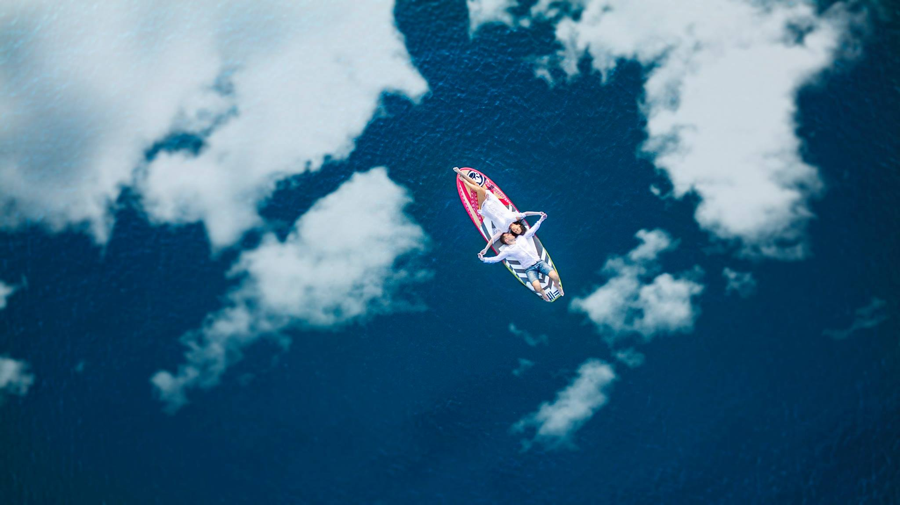

Fotografiranje i snimanje dronom iz zraka omogućuje nesvakidašnji pogled na događaje, prostore, plovila itd. Upravo će zbog toga ovakve fotografije i snimke lako privući i zadržati pažnju klijenata. Perspektiva koja inače nije lako dostupna uvest će važan element iznenađenja i omogućiti da vaša priča bude ispričana na pomalo filmski način koji nikoga neće ostaviti ravnodušnim.

  
 
Popularnost snimanja i fotografiranja dronom posljednjih je nekoliko godina sve veća. Ljubitelji dronova tvrde da se sve ljepote svijeta mogu najbolje "uhvatiti" upravo iz ptičje perspektive, a kod fotografiranja dronom najbolje je to što omogućuje jedinstven pogled koji se samo njime može postići. Dobra fotografija bespilotnom letjelicom je ona na kojoj odmah vidite da je snimljena njime, kažu znalci.