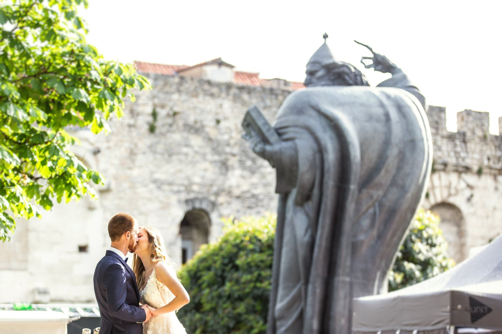

Taj divni splitski dan i divna splitska noć. Upravo tako najbolje ćemo opisati vjenčanje Lucije i Luke. Vila Dalmacija smještena u gradu pod Marjanom, mjesto koje su mladenci odabrali za svoje vjenčanje bila je savršena kulisa za fotografiranje njihovog dana iz snova.  

  
 
Uz Luciju i Luku slavili su obitelj i prijatelji i posvjedočili ljubavi okrunjenoj u jednom od najljepših gradova u Dalmaciji. Fidelis studio na njihov je poziv krenuo put Splita kako bi kamerom i foto objektivom stvorili uspomene na Lucijin i Lukin dan i tu ludu noć u Splitu punu ljubavi i odlične atmosfere. Fotografija i video snimka još će dugo pričati njihovu priču, a mi čekamo novi poziv. Jer ljubav pokreće svijet, a i Studio Jabuka pa zbog ljubavi odlazimo na destinacije koje vi birate  <3  

Organizacija vjenčanja: Lela Design 
Dizajn vjenčanja: Lela Design 
Fotograf i snimatelj vjenčanja: Studio Jabuka 
Lokacija: Split, Vila Dalmacija 
Band: Ivica Bago 